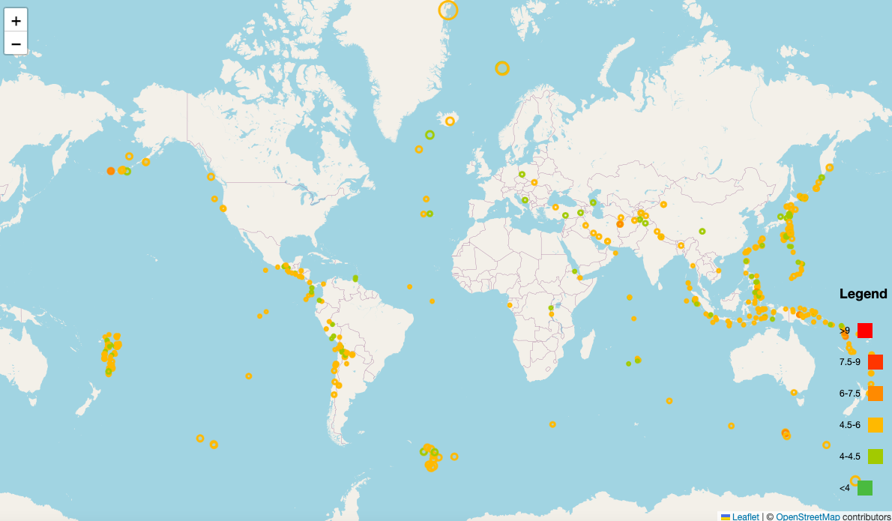

# leaflet-challenge
A project using the Leaflet library in JS to create an interactive data visualization tool.

## Depolyment
https://hazelmena.github.io/leaflet-challenge/

This project uses data from the United States Geological Survey [GeoJSON Feed](https://earthquake.usgs.gov/earthquakes/feed/v1.0/geojson.php), which provides up-to-date information on earthquakes registered around the world.  Using this data, I created a page which shows the locations of earthquakes registered in the last month with a magnitude of 4.5 or higher.  The color and size of the circle corresponds to the magnitude of the earthquakes, while the opacity reflects the depth of the earthquake.  Clicking on a circle reveals additional information about the location of the earthquake.

Help from ask cbs
